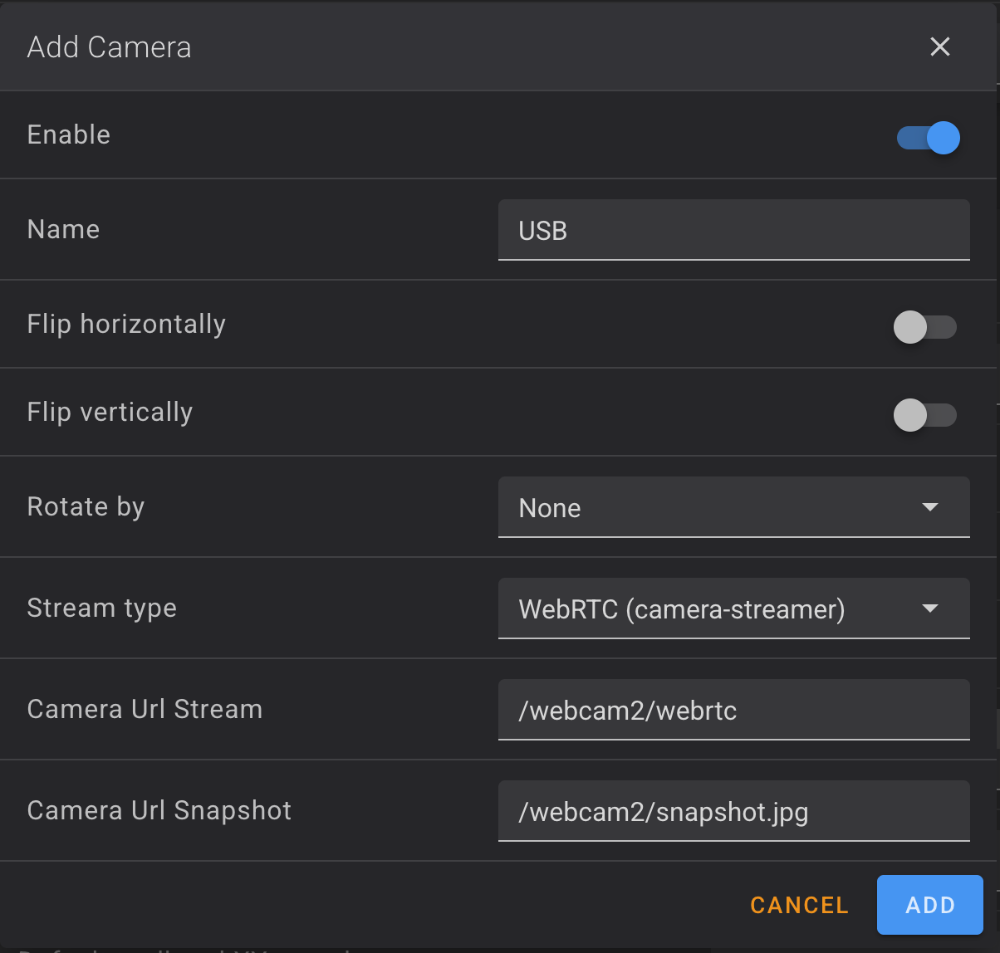

# Camera Support

**Available in: Extended firmware only**

The extended firmware includes hardware-accelerated camera support.

## Features

- Hardware-accelerated camera stack (Rockchip MPP/VPU)
- v4l2-mpp: MIPI CSI and USB camera support
- WebRTC low-latency streaming
- Hot-plug detection for USB cameras

## Accessing Cameras

### Internal Camera

Access the native camera at:

```shell
http://<printer-ip>/webcam/
```

### USB Camera

Access USB camera at:

```shell
http://<printer-ip>/webcam2/
```

You need to add USB camera in Fluidd. Use the following
settings for the best performance:



## Change Internal Camera Stream Type

By default the internal camera stream uses WebRTC for low-latency streaming.
Not all apps/integrations support WebRTC.
To switch internal camera to MJPEG or h264 stream, simply rename existing preset files using either Fluidd or SSH interface:

<details>
<summary>Click to expand Fluidd instructions</summary>

1. In web browser go to Fluidd Configuration editor at `http://<printer-ip>/#/configure`
2. Enter `moonraker` directory and right-click on the preset files to rename them
    - Disable WebRTC stream to prevent having multiple cameras in Fluidd:
      - Rename `02_webrtc_internal_camera.cfg` to `02_webrtc_internal_camera.cfg.disabled`
    - Enable mjpg-adaptive stream:
      - Rename `03_mjpg_internal_camera.cfg.disabled` to `03_mjpg_internal_camera.cfg`
    - Enable h264 stream:
      - Rename `04_h264_internal_camera.cfg.disabled` to `04_h264_internal_camera.cfg`

</details>

<details>
<summary>Click to expand SSH instructions</summary>

```bash
# Disable WebRTC stream to prevent having multiple cameras in Fluidd
cd /home/lava/printer_data/config/moonraker/
mv 02_webrtc_internal_camera.cfg 02_webrtc_internal_camera.cfg.disabled

# Enable mjpg-adaptive stream
cd /home/lava/printer_data/config/moonraker/
mv 03_mjpg_internal_camera.cfg.disabled 03_mjpg_internal_camera.cfg

# Enable h264 stream
cd /home/lava/printer_data/config/moonraker/
mv 04_h264_internal_camera.cfg.disabled 04_h264_internal_camera.cfg

# Restart moonraker to apply changes
/etc/init.d/S61moonraker restart
```

</details>

## Switch to Snapmaker's Original Camera Stack

By default, the extended firmware uses a custom hardware-accelerated camera stack.
If you prefer to use Snapmaker's original camera stack instead, create:

```shell
touch /oem/.camera-native
```

Note: Only one camera stack can be operational at a time.

## Enable Camera Logging

To enable syslog logging for camera services (useful for debugging), create:

```shell
touch /oem/.camera-log
```

This will enable the `--syslog` flag for all camera-related services. Logs will then be available in `/var/log/messages`.

## Timelapse Support

Fluidd timelapse plugin is included (no settings support).

Note: Time-lapses are not available via mobile app in cloud mode.
